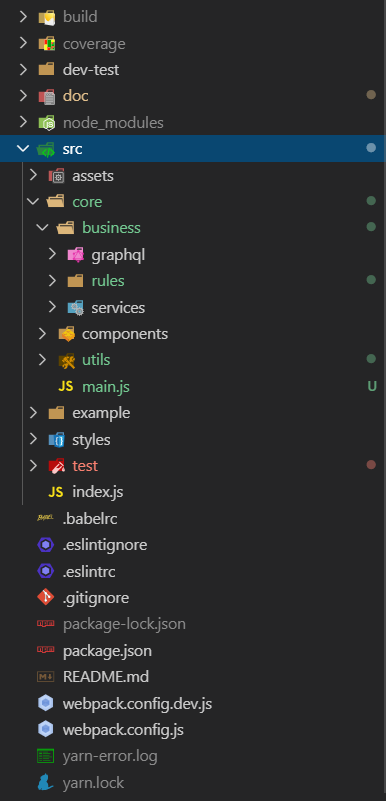
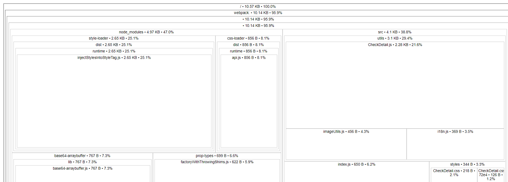
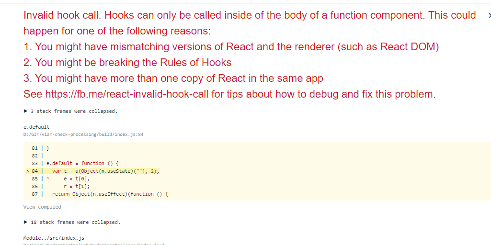

# Welcome to base-project-npm-package!

> Hi! It's a guide where you going to can know how packaging project React, build and publish in a repository npm.

## What does it?

These guide will show the following topics:

- Explains structure directory.
- Explains the package.json
- Explains the .babelrc
- Explains the webpack.config.js
- How to publish the project npm-package
- Explains some advice for good practice, so like:
  - Code coverage.
  - How to make tests.
  - How to work with development environments
  - Frequent conflicts

## Structure directory



> It is a baseline for your project, however, it is not mandatory to force your business rules to fit in this way, you are always free to look for the best way to do things, I only recommend solid documentation so that it is easy to understand.

- **build:** This folder contains the transpiled code. It is auto-generated by the command 'yarn build'.

- **coverage:** This folder contains the code coverage. It is auto-generated by the command 'yarn lint'.

- **dev-test:** This folder contains the development environment.

- **doc:** Contains the project's documentation like user story, user case and diagranmet ...

- **node_modules:** These directory is generated automatic by use 'npm install'.

- **src:** Contain your logic of application.

- **src/assets:** Contain your resources like images, fonts...

- **src/core/\*:** Contain your all rules business.

- **src/core/business/graphql:** Contain the configuration about GraphQL.

- **src/core/business/rules:** Contain all rules business.

- **src/core/business/services:** Contains calls to external services.

- **src/core/components:** It contains the component that usually returns HTML/JSX.

- **src/core/utils:** They are the files transversals to the logic.

- **src/example:** Contain the exaplme documenting for use of your application.

- **src/styles:** Contain your files of styles.

- **src/test:** They are the logic of the files of testings.

- **src/index.js:** It's application's start.

## See into to package.json

It's the file where are installs all packages required for your application.
It will be generated by the command : **npm init**
The dynamic is, configuring the project with:

- **Webpack:** It is the library for will add the static elements (css, images) in the moment transpilation of the project. https://webpack.js.org/
- **Babel:** It's library for will transpilation your code jsx to javascript. https://babeljs.io/
- **Jest:** It's the library for will transpilation your code jsx to javascript. https://jestjs.io/
- **Eslint:** It can validate your code quality in React. https://eslint.org/

```Json5
   {
  "private": false, // If your application is access to public or private.
  "name": "@demo/aplicattion", // Name of the application, if use @name indicated it's a company repository.
  "version": "1.0.5", // Number version.
  "description": "A React component ...", // It's description your application.
  "main": "build/index.js", // Location the build your application.
  // See section: 'If you are going to deploy in development mode'.
  "scripts": {
    "debug": "webpack --watch --mode development --devtool inline-source-map",
    "build": "webpack --mode production",
    "test": "jest --coverage --watchAll=false",
    "test:w": "jest --coverage --watchAll=true",
    "lint": "pretty-quick --staged && eslint src/ --fix && git add .",
    "start:dev": "webpack-dev-server --watch --config ./webpack.config.dev.js",
    "build:debug": "webpack --mode production --colors --devtool source-map",
    "analizedependences": "source-map-explorer 'build/*.js'"
  },
  // It's the configuration for it can validate your code quality in React
  "husky": {
    "hooks": {
      "pre-commit": "yarn build && yarn lint",
      "pre-push": "yarn test"
    }
  },
  "eslintConfig": {
    "extends": "react-app"
  },
  // It is a link to your repository if you want to support your application.
  "repository": {
    "type": "git",
    "url": "https://github.com/xxxx.git"
  },
  // keywords --> They are keywords, it will leave in the publish of package npm.
  "keywords": [
    "react",
    "xxxx",
    "xxxx",
    "xxxx"
  ],
  "author": "xxxx xxxx", // Name author.
  "license": "ISC", // Type license.
  // They are the packages required and minimum for work the application with React.
  // You can install all the packages you need here. **(npm install <package>)**
  "dependencies": {
    "react": "^16.8.3",
    "react-dom": "^16.8.3"
  },
  // Note:
  // "peerDependencies are a special type of dependency that is only
  // needed if you are publishing your package.
  // Having a peer dependency means that your package needs a
  // dependency that is exactly the same dependency as the person
  // installing your package. This is useful for packages such as
  // react that need to have a single copy of react-dom that
  // is also used by the person installing your package".
  // You should copy all dependency packages here.
  // That solves compatibility problems and asks first if the father already has them installed.
  "peerDependencies": {
    "react": "^16.8.3",
    "react-dom": "^16.8.3"
  },

  // They are the packages required and minimum for work the application with React in development mode.
  // So, these packages is not will install in production mode.
  "devDependencies": {
    "@babel/core": "^7.5.5",
    "@babel/plugin-proposal-class-properties": "^7.5.5",
    "@babel/preset-env": "^7.5.5",
    "@babel/preset-react": "^7.0.0",
    "@testing-library/react": "^9.1.3",
    "babel-cli": "^6.26.0",
    "babel-eslint": "^10.0.3",
    "babel-jest": "^24.9.0",
    "babel-loader": "^8.0.6",
    "babel-plugin-transform-object-rest-spread": "^6.26.0",
    "babel-plugin-transform-react-jsx": "^6.24.1",
    "css-loader": "^3.2.0",
    "eslint": "6.1.0",
    "eslint-config-airbnb": "18.0.1",
    "eslint-config-prettier": "^6.1.0",
    "eslint-loader": "^3.0.0",
    "eslint-plugin-import": "2.18.2",
    "eslint-plugin-jsx-a11y": "6.2.3",
    "eslint-plugin-prettier": "^3.1.0",
    "eslint-plugin-react": "7.14.3",
    "eslint-plugin-react-hooks": "1.7.0",
    "file-loader": "^4.2.0",
    "husky": "^3.0.5",
    "jest": "^24.9.0",
    "lint-staged": "^9.2.5",
    "node-sass": "^4.13.0",
    "prettier": "^1.18.2",
    "pretty-quick": "^1.11.1",
    "react-test-renderer": "^16.9.0",
    "sass-loader": "^8.0.0",
    "style-loader": "^1.0.0",
    "url-loader": "^2.1.0",
    "webpack": "^4.12.0",
    "webpack-cli": "^3.3.7",
    "webpack-dev-server": "^3.9.0"
  }
}

```

## See into to .babelrc

It's library for will transpilation your code jsx to javascript.

```Json5
{
    // They are the necessary components for code transpilation.
    "presets": ["@babel/preset-env", "@babel/preset-react"],
    // Here: You can add the necessary add-ons to interpret the writing style of the code.
    "plugins": [
        "@babel/plugin-proposal-class-properties",
        "transform-object-rest-spread",
        "transform-react-jsx"
    ]
 }
```

## See into to .webpack.config.js

It is the library for will add the static elements (css, images) in the moment transpilation of the project.

```Javascript
const path = require("path");

module.exports = {
  // It's point start.
  entry: "./src/index.js",
  // It is the output to build.
  output: {
    path: path.resolve(__dirname, "build"),
    filename: "index.js",
    libraryTarget: "commonjs2"
  },
  // WARNING! Only use this resolve configuration if peerDependencies fail to solve it (in theory this works the as peerDependencies).
  resolve: {
    extensions: [".js", ".jsx"],
    alias: {
      react: path.resolve("./node_modules/react"),
      "react-dom": path.resolve("./node_modules/react-dom"),
      "react-i18next": path.resolve("./node_modules/react-i18next")
    }
  },
  module: {
    // This rule, it read the files .js
    rules: [
      {
        test: /\.js$/,
        include: path.resolve(__dirname, "src"),
        exclude: /(node_modules|build)/,
        use: {
          loader: "babel-loader",
          options: {
            presets: ["@babel/preset-env"]
          }
        }
      },
      // This rule, it read and load the files .css
      {
        test: /\.css$/i,
        use: ["style-loader", "css-loader"]
      },
      // This rule, it read and load the files .scss
      {
        test: /\.s[ac]ss$/i,
        use: ["style-loader", "css-loader", "sass-loader"]
      },
      // This rule, it read and load the files png|jpeg|jpg|gif
      {
        test: /\.(png|jpe?g|gif)([\?]?.*)$/,
        loader: "file-loader?name=assets/images/[name].[ext]"
      },
      // This rule, it read and load the files svg|woff|woff2|ttf|eot|otf
      {
        test: /\.(svg|woff|woff2|ttf|eot|otf)([\?]?.*)$/,
        loader: "file-loader?name=assets/fonts/[name].[ext]"
      },
      // This rule, it read the files jsx (React files)
      {
        test: /\.(js|jsx)$/,
        exclude: /node_modules/,
        use: ["babel-loader", "eslint-loader"]
      }
    ]
  },
  // Here copy external dependencies for the package is lighter
  externals: {
    react: "commonjs react"
  }
};
```

## How to publish the project

Follow the steps below:

- npm login
- npm build
- npm publish or npm publish --scope=organization name
- npm unpublish --scope=organization --force
- "--scope": is only necessary if the package name in the package.json file does not have the company name as a prefix. Always the company name must be with the "@-2 at the beginning and a separator "/" at the end in the package.json file: @company/demo-react-to-npm-package

```Json5
   {
  	"name": "@company/demo-react-to-npm-package",
  		....
  }
```

## Good practices

- It's a good idea to implemented tests. (this guide ready configured Jest), example Jest: https://jestjs.io/docs/en/snapshot-testing
- It is important to configure code coverage. (this guide ready configured Eslint), list rules: https://eslint.org/docs/rules/
- It's sometimes helpful to add README.
- It would be great to implement the SOLID principles. https://blog.usejournal.com/how-to-apply-solid-principles-in-react-applications-6c964091a982
- If you want to test your package in local mode, use it:
  **Example Windows**
  This creates a symbolic connection between two projects. https://docs.npmjs.com/cli/link

## How to work with development environments

##### If you are going to deploy in production

```Shell
# In your package project:
npm build
npm publish
# Remember the company name in the package.json or --scope in npm command

# In the contnent project:
npm install @company_name/package_name # If is a private business package
npm install package_name # If is a public business package
```

##### If you are going to deploy in development mode

```Shell

npm run debug # If you want to run development mode with source_map, you can use this command if you are going to work with a debugger

npm run build # create the bundles/package in production mode

npm run test # If you want to unit test with a watcher.

npm run test:w # If you want to unit test without a watcher.

npm run lint # The system apply linter to the code

npm run start:dev # If you want to raise a development server to try in a web browser.

npm run build:debug # create the bundles/package in production mode with a map necesary to run the next command

npm run analizedependences # run a plugin that show the weight of each package inside you package, you can see an example on 'Validate weight of package' section.

npm link # This command will make a package works locally in your PC as temp package.

# In the contnent project:
npm link package_name # It's the same as running npm i package_name

```

- When you finish testing in development, remember to remove the npm link

```Shell
# In the content project
npm unlink package_name

# In the package project
npm unlink
```

## Validate weight of package

you can run the next commands to see the result of the bundle :

- `npm run build:debug`
- `npm run analizedependences`



## Frequent conflicts

#### When you get "Invalid hooks call" error on development using link

If you are trying to test your package with hooks using npm link, maybe you can get the following error:


To solve that, you must follow the next steps:

1. unlink the package project from content project
2. run npm link ../contentproject/node_modules/react from package project
3. build package project
4. link again the package project from content project
   more info : https://reactjs.org/warnings/invalid-hook-call-warning.html#duplicate-react
5. Another possible solution is to run the project in development mode, like this: **yarn start: dev**

#### When you get an error with npm link

> When working with the components, keep in mind the following conflicts:

**1. Conflict:**

> A developing A package cannot be called (via npm link) to another developing B package.

**Solution:**

> Finish a package A first and publish it in the npm account (npm publish --scope = company) and in package B that is in development you are installed package A already published (npm and package A)

**2. Conflict:**

> If you are using the “base package” with the multilanguage functionality, you cannot “link” to the B package in development.

**Solution**

> Apply the same solution from the previous point.
